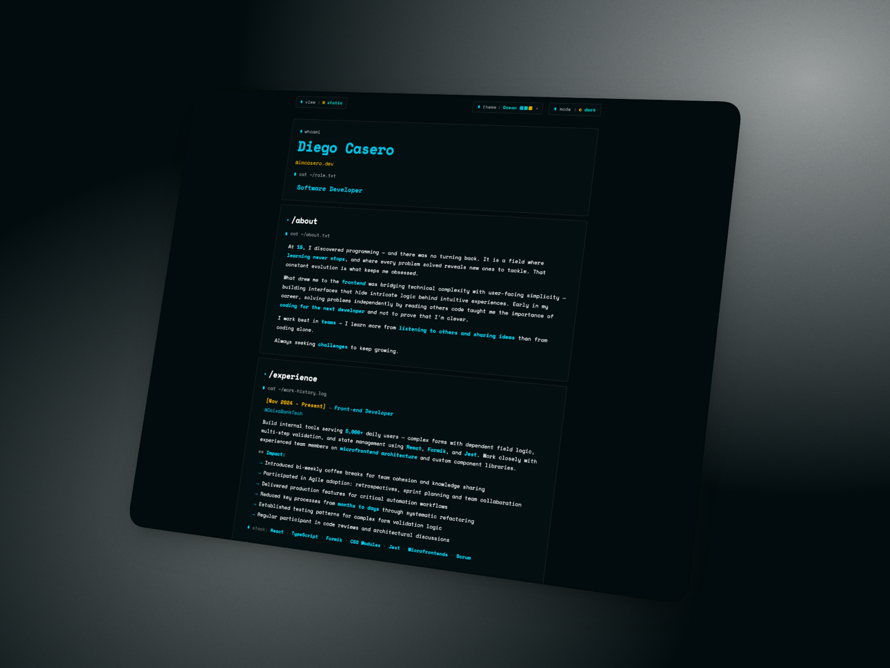

<div align="center">

# 🌐 imcasero.dev

My personal portfolio — a minimal, themeable site with a static view **and** an interactive terminal mode.

[](https://svelte.dev/)
[](https://www.typescriptlang.org/)
[](https://vitejs.dev/)
[](https://tailwindcss.com/)
[](https://vercel.com/)

[**Visit the site →**](https://imcasero.dev)

</div>

---

<p align="center">
  
</p>

---

## ✨ Highlights

- 🌓 **Light / Dark mode** with system preference sync
- 🎭 **9 custom accent themes** — Mono, Ocean, Dracula, Monokai, Nord, Solarized, Catppuccin, Gruvbox, Rose Pine
- 💻 **Interactive terminal view** with a small set of real commands
- 📱 **Fully responsive** across devices
- ⚡ **Instant load** powered by Vite + Svelte 5 runes

## 🛠️ Stack

| Tool                                          | Role                    |
| :-------------------------------------------- | :---------------------- |
| [Svelte 5](https://svelte.dev/)               | UI framework (runes)    |
| [TypeScript](https://www.typescriptlang.org/) | Type safety             |
| [Vite](https://vitejs.dev/)                   | Dev server & bundler    |
| [Tailwind CSS v4](https://tailwindcss.com/)   | Styling (OKLCH theming) |
| [Vitest](https://vitest.dev/)                 | Testing                 |
| [Vercel](https://vercel.com/)                 | Hosting                 |

## 🚀 Getting started

```bash
pnpm install   # install dependencies
pnpm dev       # start dev server
pnpm build     # production build
pnpm preview   # preview production build
```

## 👤 Author

**Diego Casero** — [@imcasero](https://github.com/imcasero)

## 📄 License

Released under the [MIT License](./LICENSE) — feel free to fork, remix, or use it as a starting point for your own portfolio. A small credit is appreciated but not required.

<div align="center">

⭐ If you like it, drop a star!

</div>
